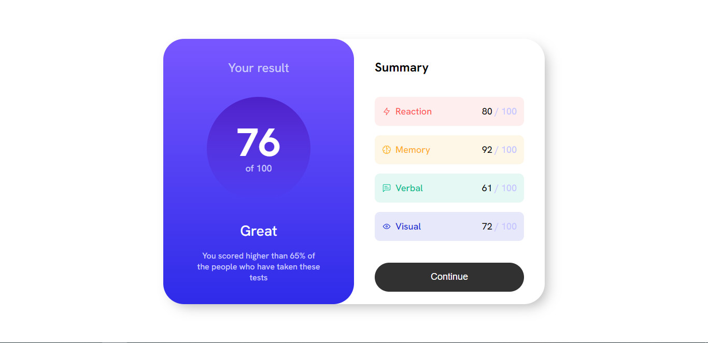

# Frontend Mentor - Results summary component solution

This is a solution to the [Results summary component challenge on Frontend Mentor](https://www.frontendmentor.io/challenges/results-summary-component-CE_K6s0maV). Frontend Mentor challenges help you improve your coding skills by building realistic projects. 

## Table of contents

- [Overview](#overview)
  - [The challenge](#the-challenge)
  - [Screenshot](#screenshot)
  - [Links](#links)
- [My process](#my-process)
  - [Built with](#built-with)
  - [What I learned](#what-i-learned)
  - [Continued development](#continued-development)
  - [Useful resources](#useful-resources)
- [Author](#author)
- [Acknowledgments](#acknowledgments)

**Note: Delete this note and update the table of contents based on what sections you keep.**

## Overview
  I just created a result-summary website based on the Mentor Frontend challenge. Based on what I just learned, I haven't really mastered skills such as CSS reuse, and responsive web design on multiple mobile device sizes. I need to study and practice more

### The challenge

Users should be able to:

- View the optimal layout for the interface depending on their device's screen size
- See hover and focus states for all interactive elements on the page

### Screenshot




### Links

- Solution URL: https://github.com/Kiet-Workspace/results-summary-component.git
- Live Site URL: https://kiet-workspace.github.io/results-summary-component/

## My process

### Built with

- Semantic HTML5 markup
- CSS custom properties
- Flexbox
- Media query

### What I learned
- I learned about Media query

```css

@media screen and (max-width: 375px) {

}
```


### Continued development

I want to continue to perfect my web development skills

### Useful resources

- [open source icon](https://iconoir.com/) - It helps me find and use the icons i need to add to my web


## Author
- Frontend Mentor - [@Kiet-Workspace](https://www.frontendmentor.io/profile/Kiet-Workspace)


